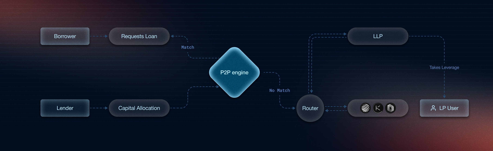

- **P2P Matching Engine**: Borrowers are directly matched with lenders in real-time, ensuring optimal interest rates for both parties without relying solely on pooled liquidity.

- **Routing idle liquidity**: When a direct match isn't available, the Router directs idle liquidity to LLP pools or fallback pools, ensuring the highest yield per dollar and eliminating idle capital

- **Collateralised Borrowing**: Borrowers deposit collateral to borrow funds. This collateral is deployed into the underlying protocol so that it earns while backing the loan, maximising capital efficiency.

- **liquidation**: If a borrower fails to make repayments, a proportional portion of their collateral is automatically liquidated. This ensures the protocol stays solvent and protects lenders from bad debt.

- **Instantaneous withdrawals**: Lenders can withdraw their capital instantly at any time. Paystream enables this by combining unmatched funds, borrower collateral, and other liquidity sources to fulfill withdrawals.

- **Leveraged Liquidity Provisioning**: Users can invest in liquidity pools like CLM (concentrated liquidity markets), DLMM or DAMM  with leverage ranging from 1x to 4x by borrowing additional capital through Paystream and paying interest on the borrowed funds. This LLP layer will serve as both an incentive for borrowers and a fallback mechanism for unmatched P2P funds.

- **Strategies**: Paystream runs delta-neutral funding strategies (perp-to-perp and spot-to-perp) to earn from perpetual funding rates without directional risk. We use Hyperliquid, Drift, Pacifica, and Lighter, with pre-entry safety gates, margin tiers, and a kill switch. See [Strategies](/strategies/overview) for the full picture.
