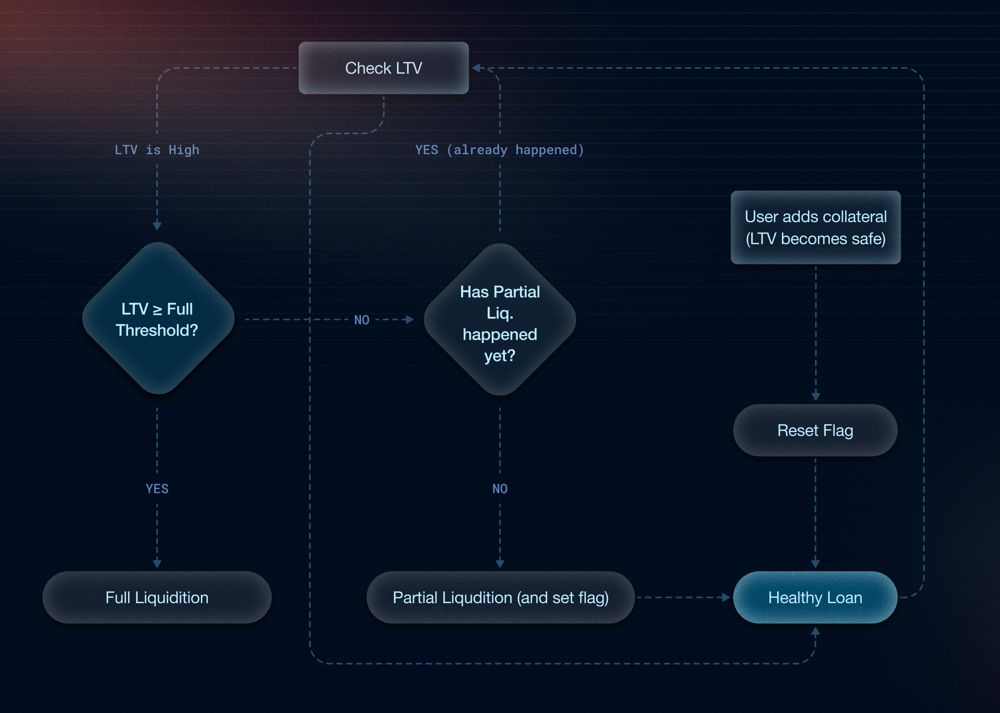
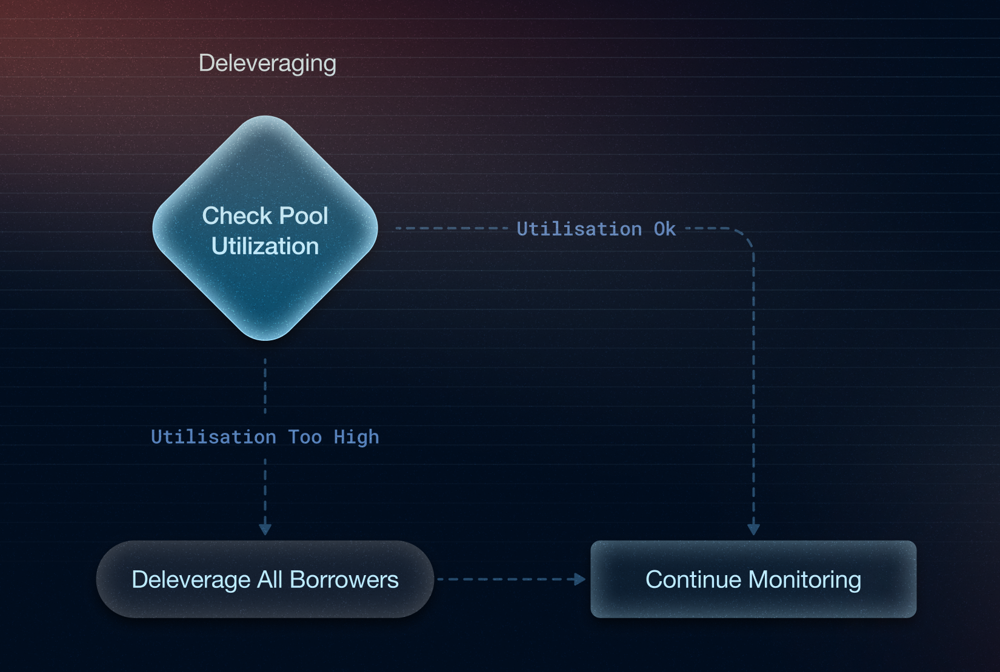

This mechanism safeguards both the **lenders’ funds** and the **integrity of the protocol**.

This section is temporarily hidden.

{/*


The purpose of liquidation is to ensure that the protocol can recover the full value of the borrowed principal token, so that lenders are returned the exact amount of the principal they deposited.

Therefore, the **Loan-to-Value (LTV)** calculation is done entirely in terms of the **principal token** (or usd )  for both the **borrowed amount** and the **current value of the position**.

Borrowers can avoid liquidation by **increasing their margin**, either:

- **Manually**, by adding more funds to the position, or
- **Automatically**, by enabling **auto-mode**, provided their wallet maintains sufficient balance. (in the future)

To manage risk effectively, the protocol employs multiple layers of protection beyond full liquidation. Partial liquidation is triggered when an individual borrower’s LTV exceeds a certain threshold, allowing only part of their position to be sold to bring their LTV back into a safer range. In extreme cases where overall pool utilisation exceeds safe limits, the protocol initiates deleveraging, proportionally reducing all borrower debts to restore system-wide liquidity. Borrowers can also avoid liquidation entirely by increasing their margin, either manually by adding more collateral or (in the future) automatically through wallet-based top-ups.




## **LTV (Loan-to-Value) & Liquidation Logic**

**LTV (Loan-to-Value)** measures how much the borrower has borrowed compared to the current value of their position (LP + collateral).

- **Formula**:
    
    `LTV = Debt / Position Value`
    
    ```markdown
    Debt = principal × (BLI_now / BLI_entry)
    
    Note - everywhere, debt is constantly increasing using 
    this formula
    ```
    
- If the LTV gets too high (e.g., 85–90%), it means the borrower's position is no longer safely over-collateralised and is at risk.

---

## Partial Liquidation Logic (Individual Risk Control)

Partial liquidation is a protocol-level risk-mitigation step that sells a portion of an over-leveraged borrower’s position when their Loan-to-Value (LTV) climbs above a preset threshold, yet before a full liquidation is required.
The sale proceeds are used to repay part of the borrower’s debt, pushing the LTV back into a safer range.


- Partial liquidation is designed as a **borrower-friendly safeguard and a way to safeguard lenders' funds from being completely lost**, offering a chance to stabilise their position **before full liquidation** is triggered, especially during volatile market conditions.

- **Trigger**: When an individual borrower's **LTV** crosses the **partial threshold** (e.g., 85%).
- **Action**: A calculated portion of their LP position is closed. The resulting assets are used to repay part of the debt.
- **Goal**: Bring the LTV back to a safer range (e.g., down to 75%) **without liquidating the entire position**.
- **Why**: This protects **lender funds** while giving borrowers a **fairer chance** to recover compared to immediate full liquidation.

### One-Time Liquidation Logic

- **Partial liquidation** is triggered **once** per liquidation cycle.
- If the borrower **adds more funds** and LTV drops below the **safe threshold**, they become eligible for **partial liquidation again** in the future.
- For now, **partial liquidation is only applied to blue-chip and mid-cap assets**

### Precision-Based Recovery (Not Fixed Slice)

Unlike protocols that liquidate a **fixed slice** (e.g., 50%), our system calculates the exact value needed to **recover 80% of the lender’s principal**, based on:

- The **borrower’s leverage**
- Current **LTV**
- Position size and debt

Position to liquidate = 0.8 x borrowed amount

*Note: `borrowed amount = debt` in calculations.*

### Example Scenario

Let’s say:

- `partial_threshold = 80 %`
- `full_threshold = 90 %`
- `safe_threshold = 70 %`

1. Borrower LTV hits 80 %
    - Partial liquidation triggers, the flag is set.
2. Borrower does **nothing**, LTV reaches 91 %
    - Full liquidation triggers.
3. If, after partial liquidation, the borrower adds more collateral, the LTV drops to 65 %
    - System resets the flag; they get another shot.

### Trigger Rules

| Condition | Action |
| --- | --- |
| `LTV ≥ partial_threshold` **and** `has_been_partially_liquidated = false` | → Do **partial liquidation** (e.g. 50 %), then set `has_been_partially_liquidated = true` |
| `LTV ≥ full_threshold` **and** `has_been_partially_liquidated = true` | → **Fully liquidate** the remaining position |
| `LTV < safe_threshold` (e.g. user tops up collateral) | → Reset `has_been_partially_liquidated = false` |
|  |  |

---

##  **Deleveraging (System-Wide Risk Control)**



Deleveraging is a protocol-level mechanism used to reduce the leverage across all borrowers in a pool when risk becomes too high.
It forces partial repayments by all borrowers proportionally, helping the protocol bring utilisation back to a safe level.

We deleverage, which is to reduce the leverage (lenders' funds that the borrower has borrowed) :

- To ensure enough liquidity is available for lenders to withdraw their funds at any time.

- To reduce systemic risk in the pool by lowering the average leverage across all borrowers.

- **Trigger**: Utilisation of the lending pool exceeds a critical limit (e.g., 95%) and lenders may not be able to withdraw.
- **Action**: A portion of **all borrower positions** are liquidated proportionally, e.g., user 1 has $200 borrowed, user 2 $50 → both repay 10% of their debt.


### Debt to liquidate

**ΔB = totalBorrowed − (U_target × totalDeposits)**

ΔB = B − U_target · D

**Amount to liquidate per user** 

For every borrower `i` with current debt `Debtᵢ`:

```
liquidateᵢ = Debtᵢ × (ΔB / B)
```

- Every borrower repays **the same percentage** of their outstanding debt:
    
    `percentage_to_repay = ΔB / B`
    
- After liquidation, each borrower’s new debt is
    
    `Debtᵢ_new = Debtᵢ − liquidateᵢ`
*/}