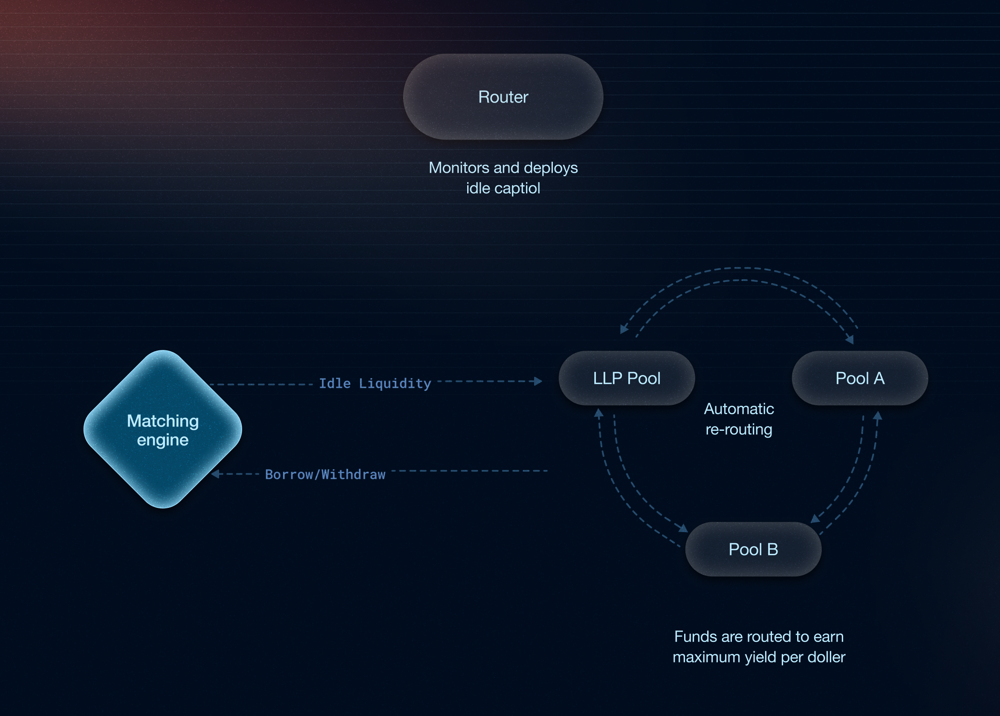

This section is temporarily hidden.

{/*

Paystream's **routing engine** acts as an intelligent liquidity optimizer that continuously monitors yield opportunities across supported lending and liquidity venues. Unlike traditional systems that hold funds in custody, the routing system never holds money itself; it simply directs capital to the most desirable locations to earn the highest yield per dollar invested.

## How the Routing System Works

The routing engine operates as a capital allocation system that ensures **zero idle capital** by automatically reallocating funds from one venue to another based on key parameters such as APY, utilization rate, deposit limits, and available reserves. The system operates on a regular cadence checking rates hourly and rebalancing every few minutes,to ensure user's deposited assets are always earning the **higest yield possible**.

When P2P matches cannot be made immediately, the router seamlessly channels funds to leveraged strategies and integrated protocols. The routing engine makes sure there is zero idle capital; **it's always either with a borrower or in a fallback pool earning yield**.

The primary routing destinations include the LLP lending pool for leveraged positions and integrated protocols like Drift, Kamino, MarginFi (Project 0), and Jupiter Lend. The routing system ensures that yield is deployed at the correct place and **rebalances when needed**, guaranteeing that every dollar of capital is continuously earning the highest possible yield, even when P2P matches aren't immediately available.

## Routing Example

**Scenario:**

1. **Alice (Lender) deposits 10,000 USDC**
   - Alice's funds are not immediately matched with a borrower
   - The routing engine **automatically routes the full 10,000 USDC to the LLP lending pool** for leveraged strategies
   - This ensures Alice's capital is earning yield while waiting for a borrower

2. **Bob (Borrower) requests 5,000 USDC**
   - Bob only needs half of Alice's deposited amount
   - The routing engine **instantly withdraws 5,000 USDC from the LLP pool** to complete the P2P match
   - Alice and Bob are **matched at an optimized P2P rate**
   - The remaining **5,000 USDC stays in the LLP pool** continuing to earn leveraged yield

3. **Market Conditions Change - Routing Optimization**
   - The routing engine detects that **Kamino now offers better yields** than the LLP pool
   - The system **automatically re-routes the remaining 5,000 USDC from the LLP pool to Kamino**
   - This ensures Alice's unmatched capital is **always earning the highest available yield**
   - The re-routing happens seamlessly without any manual intervention

4. **Future Borrower Arrives**
   - When another borrower needs the 5,000 USDC, the routing engine **instantly withdraws it from Kamino**
   - The funds are **immediately available for P2P matching** at optimal rates
   - This demonstrates how the routing system **maintains liquidity while maximizing yield**

## Benefits of the Routing System

- **Zero Idle Capital**: Every dollar is always working to generate yield
- **Automated Re-routing**: Instantly and seamlessly reallocates funds based on real-time opportunities,no manual intervention required
- **Maximum Capital Utilization**: Deploys funds to the most efficient strategies available
*/}
